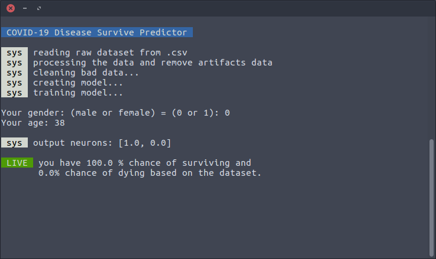

# covid19-survive-predictor

> A COVID-19 survival machine learning predictor using the dataset from Kaggle to tell you whether you will be live or dead based on your gender and age.

<p align="left">
  

### _setup

```bash
$ git clone https://github.com/loouislow81/covid19-survive-predictor.git
$ cd covid19-survive-predictor
```

set up a new python3 virtual environment for this repo,

```bash
$ virtualenv -p python3 venv
$ source venv/bin/activate
$ (venv) pip install -r requirements.txt --default-timeout=1000
```

### _usage

```bash
$ (venv) python predict.py
```

---

[MIT](https://github.com/loouislow81/covid19-survive-predictor/blob/master/LICENSE)
